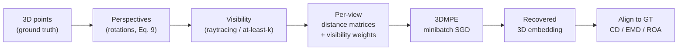

# 3DMPE: 3D Multi-Perspective Embedding

**3D point-cloud reconstruction from multiple partially observed 2D
projections**, implementing the method from:

> Vahan Huroyan, Md Rahat-uz-Zaman, Stephen Kobourov.
> *3DMPE: 3D Multi-Perspective Embedding.*
> 38th Canadian Conference on Computational Geometry (CCCG), 2026.

Given two or more 2D projections of an unknown 3D point cloud, together with
cross-view point correspondences and visibility information, 3DMPE recovers a
consistent 3D configuration - even when different views contain different
subsets of points. It is an **optimization-based, training-free** method: no
neural network, no category-specific training data. The algorithm never sees
raw pixels; each view is reduced to a matrix of pairwise 2D distances between
the points visible in it.

## Problem formulation

Let `N` be the number of points and `K` the number of views. Each view `k`
provides a pairwise distance matrix `D^k` between its *visible* points and a
visibility vector `alpha^k` (1 if point `i` appears in view `k`, else 0).
3DMPE extends the MPSE stress function to tolerate missing points (paper
Eq. 1):

```text
S(X, P; D) = sum_k sum_{i>j}  alpha_i^k * alpha_j^k * ( D_ij^k - || P^k(x_i) - P^k(x_j) || )^2
```

so that a pair `(i, j)` only contributes to view `k`'s stress when both points
are visible there. The objective is minimized with minibatch SGD, adaptive
step sizes, and early termination, in two settings:

- **Fixed projections** - the projection matrices `P^k` are known; only the
  3D coordinates `X` are optimized (paper Alg. 1, `variable_projection=False`).
- **Variable projections** - the viewpoints are unknown and estimated jointly
  with `X` (paper Alg. 2, `variable_projection=True`, the default).

**Smart initialization.** SGD is warm-started from the *baseline*
reconstruction: plain MDS on the average of the per-view distance matrices.
The paper finds this outperforms random initialization by an order of
magnitude in Chamfer distance (`smart_initialize=True`, the default).

## Pipeline



1. **Perspectives** - rotate the point cloud to simulate cameras, either about
   the Y axis only (`rotation_axes='y'`) or with the paper's general 3-axis
   rotation matrix (`rotation_axes='xyz'`, Eq. 9). Angles are drawn from
   binned sub-ranges of the angle band, half of them negated.
2. **Visibility** - keep each point in only some views, either by requiring
   each point to appear in exactly *k* views, or via a Z-buffer ray-cast that
   models self-occlusion. Point IDs are preserved, so cross-view
   correspondence is known.
3. **Distance matrices** - reduce each view to pairwise 2D distances, plus a
   binary weight matrix encoding the visibility products `alpha_i * alpha_j`.
4. **3DMPE** - jointly optimize the 3D embedding (and, optionally, the
   per-view projections) by minibatch SGD.
5. **Evaluate** - align the result to the ground truth and measure the three
   paper metrics (see below), comparing against the MDS baseline.

## Evaluation metrics

| Metric | Paper ref. | Correspondence-aware? | Function |
| --- | --- | --- | --- |
| Chamfer Distance (CD) | Eq. 5 | no | `mpe3d.metrics.chamfer_distance` |
| Earth Mover Distance (EMD) | Eq. 4 | no | `mpe3d.metrics.earth_movers_distance` |
| RMSE-Optimize-Align (ROA) | Eq. 8 | yes | `mpe3d.metrics.roa` |

CD and EMD ignore rotations/translations, so the reconstruction is first
aligned with a RANSAC-style search over random 4-point correspondences (paper
Eq. 6-7, `mpe3d.alignment.four_point_sample_transform`). ROA instead uses the
known point-to-point correspondence and the closed-form Kabsch/SVD alignment
(paper Eq. 13-16, `mpe3d.alignment.kabsch_transform`) before computing the
mean squared error over corresponding pairs.

## Noise models

Both robustness regimes from the paper (Section 3.1, Figure 5) are available
via `noise_type` / `noise_amount` (`q`, the fraction of corrupted points) /
`noise_level` (`p`, the amplitude relative to the point-cloud diameter `d`):

- **Distance noise** (`noise_type='distance'`) - additive Gaussian noise with
  variance `p * d` on a fraction `q` of the distance-matrix rows; negatives
  are clipped and symmetry is preserved.
- **Matching noise** (`noise_type='matching'`) - a fraction `q` of the points
  have their correspondence reassigned to a random point at most `p * d` away.

The paper reports that reconstructions remain acceptable (CD below ~0.2 in its
normalized setup) across a wide range of both noise types, and that 3DMPE
degrades far more gracefully than the MDS baseline.

## Key findings reproduced by this implementation

- Each point should be visible from **at least 3 viewpoints**; 4-5 views
  usually suffice for high-quality reconstruction (Figures 6-7).
- The viewpoint angle band should span **at least ~90 degrees** (Figure 15).
- **Smart initialization** beats random initialization by an order of
  magnitude and converges faster (Figure 8).
- Accuracy is largely insensitive to the number of points; runtime grows with
  points and (in the variable setting) linearly with views (Figures 3-4).

## Installation

This project is managed with [uv](https://docs.astral.sh/uv/). It pins
**Python 3.11+**; uv will fetch a suitable interpreter automatically.

```bash
cd 3DMPE
uv sync
```

## Quickstart

### Python API

```python
from mpe3d import datasets, reconstruct
from mpe3d.visualization import plot_point_clouds

# A procedurally generated torus - no downloads required.
points = datasets.get_dataset_points("demo:torus", n_points=300, normalize=True)

result = reconstruct(points, n_perspectives=5, points_in_at_least=3)
print(result.summary())
# {'chamfer': ..., 'emd': ..., 'roa': ..., 'final_cost': ...,
#  'baseline_chamfer': ..., 'baseline_emd': ..., 'baseline_roa': ...}

fig = plot_point_clouds(
    [result.ground_truth, result.aligned_embedding],
    names=["ground truth", "reconstruction"],
    colors=["green", "red"],
)
fig.show()
```

Fixed-projection 3DMPE (paper Alg. 1) with 3-axis viewpoints:

```python
result = reconstruct(points, n_perspectives=4, rotation_axes="xyz",
                     variable_projection=False)
```

### Command line

Run a single experiment; all artifacts (params, metrics, point clouds, and
interactive HTML plots) are written to a timestamped folder under `results/`:

```bash
uv run python experiments/run_experiment.py --dataset demo:torus

# Paper-style setup: raytraced visibility on a local ShapeNet model,
# 3-axis viewpoints, fixed projections.
uv run python experiments/run_experiment.py \
    --dataset ShapeNet:airplane:<model_hash> --shapenet-dir /path/to/ShapeNetCore.v2 \
    --projection raytracing --n-rays 400 --rotation-axes xyz --fixed-projection

# Noise robustness (paper Fig. 5): 5% amplitude, 40% of points corrupted.
uv run python experiments/run_experiment.py --dataset demo:torus \
    --noise-type matching --noise-amount 0.4 --noise-level 0.05
```

See `uv run python experiments/run_experiment.py --help` for all options.

### Notebooks

```bash
uv run jupyter lab
```

- `notebooks/00-dataset-showcase.ipynb` - load shapes from every supported
  dataset and tour the pipeline (the modern replacement for the old `main.ipynb`).
- `notebooks/01-pipeline-walkthrough.ipynb` - the full pipeline, stage by stage.
- `notebooks/02-noise-experiments.ipynb` - a noise-robustness sweep.
- `notebooks/03-lmnet-benchmark.ipynb` - the LMNet/ShapeNet parameter sweeps
  (quality vs. #points, #viewpoints, and point visibility).

## Benchmark sweeps

`mpe3d.benchmark` reproduces the paper's LMNet/ShapeNet sweeps (Figures 3-10)
directly from the pipeline - the numbers are computed, not hand-tuned. It runs
`reconstruct` over a grid of parameters and returns a tidy `pandas.DataFrame`:

```python
from mpe3d import benchmark, datasets

df = benchmark.run_sweep(
    datasets.lmnet_datasets(per_category=1),   # curated ShapeNet subset
    benchmark.SWEEPS["n_perspectives"],        # or "n_points", "points_in_at_least"
    datadir="/path/to/ShapeNetCore.v2",
    repeats=3,
)
ax = benchmark.aggregate(df, "n_perspectives", "chamfer")
```

Or from the command line, which also writes CSVs and per-metric plots:

```bash
uv run python experiments/run_lmnet_benchmark.py \
    --sweep n_perspectives --shapenet-dir /path/to/ShapeNetCore.v2 \
    --per-category 1 --repeats 3
```

The curated LMNet model list lives in `mpe3d.datasets.LMNET_MODELS`
(8 categories: airplane, bench, car, chair, lamp, rifle, sofa, table).

## Package layout

| Module | Responsibility |
| --- | --- |
| `mpe3d.datasets` | Load or generate ground-truth point clouds (demo primitives, ModelNet10, ShapeNet, Pix3D, toy CSV), incl. the LMNet model registry. |
| `mpe3d.views` | Simulate perspectives (Eq. 9 rotations), model visibility, build distance/weight matrices. |
| `mpe3d.noise` | Distance noise and correspondence (matching) noise, Section 3.1. |
| `mpe3d.mview` | Vendored MPSE optimizer (the numerical core). |
| `mpe3d.alignment` | 4-point RANSAC (Eq. 6-7) and Kabsch/SVD (Eq. 13-16) alignment. |
| `mpe3d.metrics` | CD / EMD / ROA metrics and the MDS baseline. |
| `mpe3d.visualization` | Interactive Plotly plots and seaborn benchmark curves. |
| `mpe3d.benchmark` | LMNet/ShapeNet parameter sweeps as tidy DataFrames. |
| `mpe3d.pipeline` | The end-to-end `reconstruct` helper. |

## Datasets

The paper evaluates on ShapeNet and Pix3D; the demo shapes are for quick,
download-free experimentation.

- **`demo`** (`demo:torus`, `demo:sphere`, `demo:box`, `demo:cone`) - generated
  on the fly, no download.
- **ModelNet10** (`ModelNet10:<category>:<index>`) - downloaded and cached
  automatically on first use (set `MPE3D_DATA_DIR` to control the cache path).
- **ShapeNet** (`ShapeNet:<category>:<model_hash>`) - requires a local
  `ShapeNetCore.v2` tree; pass its path via `--shapenet-dir` or `$SHAPENET_DIR`.
- **Pix3D** (`Pix3D:<category>:<object_id>`) - requires a local Pix3D tree; pass
  its path via `--pix3d-dir` or `$PIX3D_DIR`.
- **toy CSV** (`toy:/path/to/points.csv`) - a headerless CSV with one point per
  column.

## Citing

See `CITATION.cff`, or cite:

```bibtex
@inproceedings{huroyan2026threedmpe,
  title     = {3DMPE: 3D Multi-Perspective Embedding},
  author    = {Huroyan, Vahan and Zaman, Md Rahat-uz- and Kobourov, Stephen},
  booktitle = {Proceedings of the 38th Canadian Conference on Computational
               Geometry (CCCG)},
  year      = {2026},
}
```

## Attribution

The `mpe3d.mview` subpackage is modernized and upgraded version of the
`mview` library from the [MPSE project](https://github.com/rahatzamancse/3d-reconstruction).
The underlying MPSE algorithm is described in:

> Md I. Hossain, V. Huroyan, S. Kobourov, R. Navarrete.
> *Multi-Perspective, Simultaneous Embedding.*
> IEEE Transactions on Visualization and Computer Graphics, 27(2), 2021.
> [arXiv:1909.06485](https://arxiv.org/abs/1909.06485)
