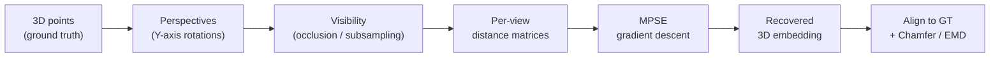

# 3DMPE

**3D point-cloud reconstruction from multi-view distance matrices, using
Multi-Perspective Simultaneous Embedding (MPSE).**

Given several 2D "views" of an object, 3DMPE recovers its 3D shape. Crucially,
the algorithm never sees the 3D points or even the raw pixels: each view is
reduced to a matrix of pairwise 2D distances between the points visible in it.
MPSE then jointly optimizes a single 3D point cloud **and** one projection per
view so that projecting the cloud through each view reproduces that view's
distance matrix.

This is an optimization-based approach (gradient descent on an embedding), not a
neural network, and it is distinct from classical photogrammetry / structure
from motion.

## How it works



1. **Perspectives** - rotate the point cloud about the Y axis to simulate cameras.
2. **Visibility** - keep each point in only some views, either by requiring each
   point to appear in at least *k* views, or via a Z-buffer ray-cast that models
   self-occlusion.
3. **Distance matrices** - reduce each view to pairwise 2D distances, plus a
   binary weight matrix marking which pairs are visible.
4. **MPSE** - jointly optimize the 3D embedding and the per-view projections.
5. **Evaluate** - rigidly align the result to the ground truth and measure
   Chamfer distance and Earth Mover's Distance, comparing against a plain-MDS
   baseline.

## Installation

This project is managed with [uv](https://docs.astral.sh/uv/). It pins
**Python 3.11+**; uv will fetch a suitable interpreter automatically.

```bash
cd 3DMPE
uv sync
```

## Quickstart

### Python API

```python
from mpe3d import datasets, reconstruct
from mpe3d.visualization import plot_point_clouds

# A procedurally generated torus - no downloads required.
points = datasets.get_dataset_points("demo:torus", n_points=300, normalize=True)

result = reconstruct(points, n_perspectives=5, points_in_at_least=3, max_iter=200)
print(result.summary())
# {'chamfer': ..., 'emd': ..., 'final_cost': ...,
#  'baseline_chamfer': ..., 'baseline_emd': ...}

fig = plot_point_clouds(
    [result.ground_truth, result.aligned_embedding],
    names=["ground truth", "reconstruction"],
    colors=["green", "red"],
)
fig.show()
```

### Command line

Run a single experiment; all artifacts (params, metrics, point clouds, and
interactive HTML plots) are written to a timestamped folder under `results/`:

```bash
uv run python experiments/run_experiment.py --dataset demo:torus

# Ray-traced visibility on a local ShapeNet model:
uv run python experiments/run_experiment.py \
    --dataset ShapeNet:airplane:<model_hash> --shapenet-dir /path/to/ShapeNetCore.v2 \
    --projection raytracing --n-rays 400
```

See `uv run python experiments/run_experiment.py --help` for all options.

### Notebooks

```bash
uv run jupyter lab
```

- `notebooks/01-pipeline-walkthrough.ipynb` - the full pipeline, stage by stage.
- `notebooks/02-noise-experiments.ipynb` - a noise-robustness sweep.

## Package layout

| Module | Responsibility |
| --- | --- |
| `mpe3d.datasets` | Load or generate ground-truth point clouds (demo primitives, ModelNet10, ShapeNet, Pix3D, toy CSV). |
| `mpe3d.views` | Simulate perspectives, model visibility, build distance/weight matrices. |
| `mpe3d.noise` | Inject distance or matching noise. |
| `mpe3d.mview` | Vendored MPSE optimizer (the numerical core). |
| `mpe3d.alignment` | Align a reconstruction to the ground truth. |
| `mpe3d.metrics` | Chamfer / EMD metrics and an MDS baseline. |
| `mpe3d.visualization` | Interactive Plotly plots. |
| `mpe3d.pipeline` | The end-to-end `reconstruct` helper. |

## Datasets

- **`demo`** (`demo:torus`, `demo:sphere`, `demo:box`, `demo:cone`) - generated
  on the fly, no download.
- **ModelNet10** (`ModelNet10:<category>:<index>`) - downloaded and cached
  automatically on first use (set `MPE3D_DATA_DIR` to control the cache path).
- **ShapeNet** (`ShapeNet:<category>:<model_hash>`) - requires a local
  `ShapeNetCore.v2` tree; pass its path via `--shapenet-dir` or `$SHAPENET_DIR`.
- **Pix3D** (`Pix3D:<category>:<object_id>`) - requires a local Pix3D tree; pass
  its path via `--pix3d-dir` or `$PIX3D_DIR`.
- **toy CSV** (`toy:/path/to/points.csv`) - a headerless CSV with one point per
  column.

## Attribution

The `mpe3d.mview` subpackage is a trimmed, lightly modernized copy of the
`mview` library from the [MPSE project](https://github.com/rahatzamancse/MPSE)
by Rahat Zaman et al. The MPSE algorithm is described in:

> Md I. Hossain, et al. *Multi-Perspective, Simultaneous Embedding.*
> IEEE Transactions on Visualization and Computer Graphics, 2021.
> [arXiv:1909.06485](https://arxiv.org/abs/1909.06485)
